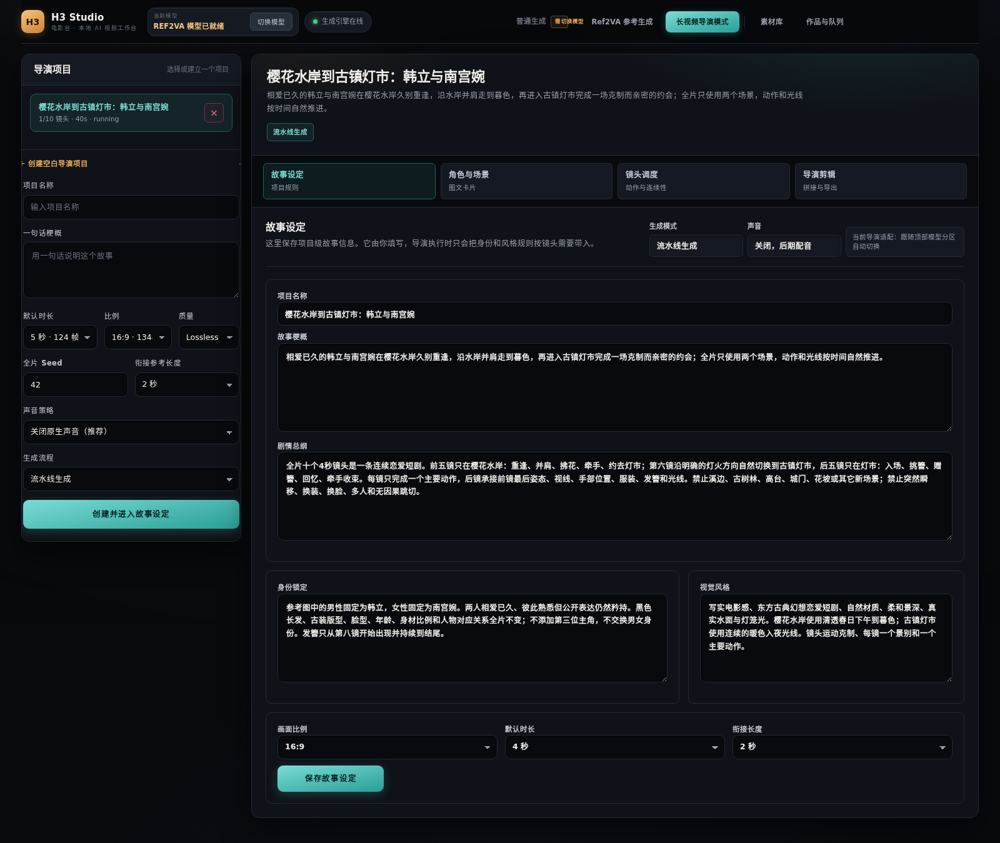
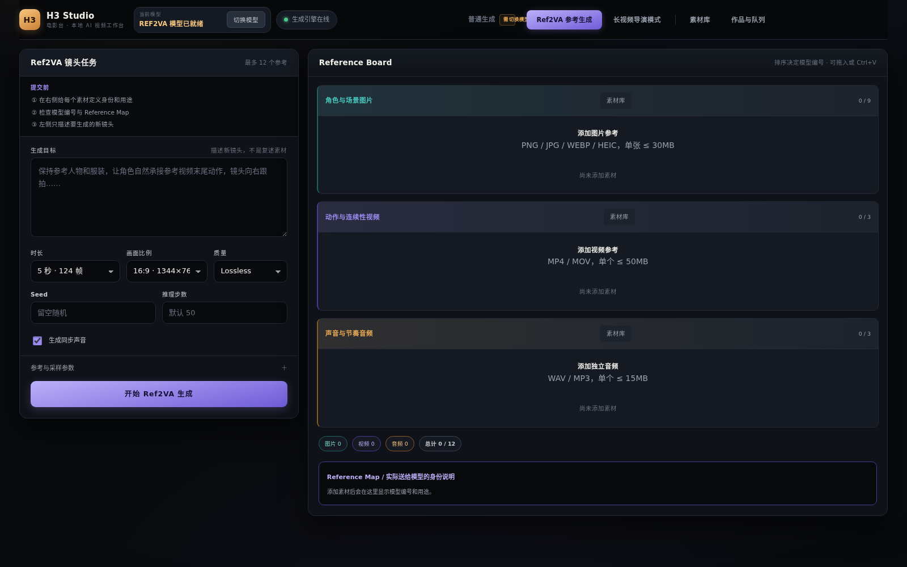
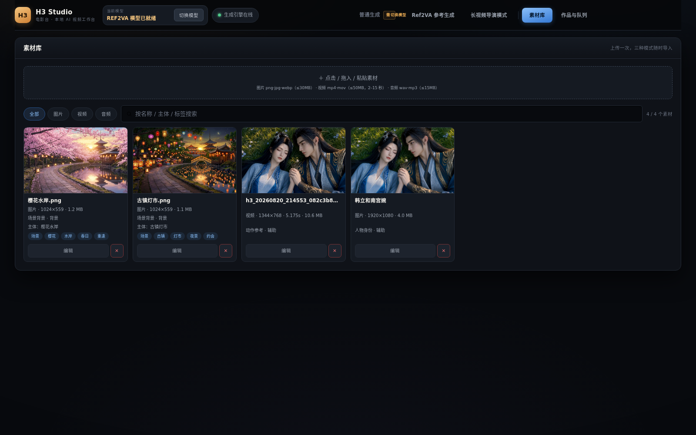
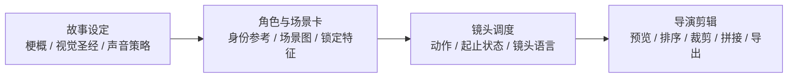

# MiniMax-H3 Studio

> A visual workbench for MiniMax-H3: single-shot generation, Ref2VA continuity, and multi-shot director pipelines.

[](https://github.com/Bozheng-Li/Minimax-H3-Studio)
[](https://fastapi.tiangolo.com/)
[](https://github.com/Bozheng-Li/Minimax-H3-Studio)
[](config.example.yaml)

MiniMax-H3 Studio 把模型调用、参考素材、连续镜头、导演调度和成片导出放进同一个工作台。它既可以连接本地部署的 MiniMax-H3，也可以连接兼容 `/v1/videos` 的远程 API。仓库只发布工作台核心代码，不包含模型权重、密钥、用户素材或运行状态。

## 真实 Demo

下面不是概念图，而是仓库当前导演项目实际使用的素材和实际生成结果。视频是 Ref2VA 导演流程的第 1 个 4 秒镜头，输出为 `1344×768 / H.264 / AAC`；点击海报即可打开原始 MP4。

<p align="center">
  <a href="docs/demo/hanli-nangongwan-shot-01.mp4">
    
  </a>
</p>

<p align="center"><sub>实际生成结果 · 樱花水岸重逢 · 4.459 秒 · Ref2VA · 仅保留环境声，后期配音</sub></p>

<table>
  <tr>
    <td width="33%"></td>
    <td width="33%"></td>
    <td width="33%"></td>
  </tr>
  <tr>
    <td align="center"><sub>人物身份参考</sub></td>
    <td align="center"><sub>前半段唯一场景：樱花水岸</sub></td>
    <td align="center"><sub>后半段唯一场景：古镇灯市</sub></td>
  </tr>
</table>

这组素材对应一个 10 镜头、每镜 4 秒的连续恋爱短剧：前 5 镜在樱花水岸重逢与并肩，镜头 6 显式切换到古镇灯市，后 5 镜完成挑簪、赠簪和牵手收束。场景图、人物图和镜头文本都来自导演项目数据，不写死在代码中。

## 先看界面

这不是命令行脚本集合，而是一个可直接运行的浏览器工作台。下面的截图来自真实运行中的界面回归验收：

| 导演模式 | Ref2VA 参考生成 | 素材库 |
| --- | --- | --- |
|  |  |  |

导演模式按四层组织信息：



## 适合什么工作

| 工作 | 使用入口 | 解决的问题 |
| --- | --- | --- |
| 试一个镜头 | 普通生成 | 快速验证提示词、比例和时长 |
| 让人物稳定 | Ref2VA | 用人物图、场景图和参考视频约束身份与动作 |
| 做连续短剧 | 导演模式 | 把故事拆成镜头，并自动承接上一镜尾部 |
| 管理素材 | 素材库 | 图片、视频、音频跨工作区复用 |
| 输出成片 | 导演剪辑 | 排序、裁剪、调音、拼接并导出 MP4 |

## 30 秒看懂一次完整流程

```text
上传人物图 / 场景图
        ↓
在角色卡和场景卡中定义“模型该读取什么”
        ↓
每个镜头只写一个主要动作，并保存开始/结束状态
        ↓
pipeline 自动生成下一镜，或切换 review-gate 逐镜审核
        ↓
在导演剪辑中预览、调整顺序、裁剪、拼接、导出
```

导演模式的核心连续性规则：

- 镜头显式绑定新场景图时才切换场景。
- 没有绑定新场景图时，默认继承上一镜的空间、光线、站位和尾部参考视频。
- `pipeline` 是默认模式，上一镜完成后自动继续下一镜，不等待审核。
- `review_gate` 只在需要人工把关时使用；审核退回只重生成被退回的镜头，不会破坏其它镜头。
- 4 秒镜头建议只放一个主要动作、一个景别和一次克制的镜头运动。

## 安装

```bash
git clone https://github.com/Bozheng-Li/Minimax-H3-Studio.git
cd Minimax-H3-Studio
cp config.example.yaml config.yaml
python3 -m venv .venv
. .venv/bin/activate
pip install -r requirements.txt
```

系统依赖：`ffmpeg`；本地模式还需要 CUDA、匹配当前环境的 `vllm-omni` 和 `tmux`。只使用远程 API 时不需要本地模型权重。

## 一个 YAML 管全局

所有部署差异都集中到 `config.yaml`，模板见 [`config.example.yaml`](config.example.yaml)：

```yaml
provider:
  mode: api                       # local 或 api
  base_url: https://api.example.com
  api_key_env: MINIMAX_H3_API_KEY
  model: MiniMax-H3

local:
  partition: ref2va               # fl2va 或 ref2va
  model_root: ./models/MiniMax-H3
  cuda_visible_devices: 0,1

storage:
  outputs: outputs
  director_file: data/state/director_projects.json
```

Key 的优先级是：`api_key_env` 指定的环境变量 → `H3_API_KEY` → `provider.api_key` 文件 → `provider.api_key` 明文。明文可以用于本地临时测试，但公开部署应使用环境变量或权限为 `0600` 的文件。

## 启动方式

### 远程 API 模式

```bash
export MINIMAX_H3_API_KEY='your-api-key'
./scripts/run_frontend.sh
```

打开 <http://127.0.0.1:7860>。此模式不加载本地权重，普通生成、Ref2VA 和导演模式是否可用由 `provider.tasks` 决定。

### 本地模型模式

把 `local.model_root` 指向包含 `FL2VA/` 和 `Ref2VA/` 的模型目录：

```bash
./scripts/run_h3.sh
./scripts/run_frontend.sh
```

本地内存不足时不要同时加载两个 DiT 分区。顶部“切换模型”按钮会通过 `/api/model/switch` 有序停止旧分区、加载目标分区并显示阶段进度：

```bash
curl -X POST http://127.0.0.1:7860/api/model/switch \
  -H 'Content-Type: application/json' \
  -d '{"partition":"ref2va"}'
```

## 使用示例一：单镜头生成

这是最小的工作台 API 请求。前端表单最终也会提交同一类数据：

```bash
curl -X POST http://127.0.0.1:7860/api/generate \
  -F 'payload={"prompt":"雨后的古镇街巷，纸灯笼在风中轻晃，镜头缓慢向前推进。","task":"t2va","seconds":5,"aspect_ratio":"16:9","quality":"lossless","generate_sound":false,"seed":42}'
```

返回任务 ID 后查看进度：

```bash
curl http://127.0.0.1:7860/api/jobs
curl http://127.0.0.1:7860/api/health
```

如果使用 FL2VA 或 Ref2VA，按接口要求附带 `images`/`references` 文件。模型生成、VAE 解码、编码和下载是独立阶段，界面会分别显示当前阶段、真实去噪步数和动态 ETA。

## 使用示例二：创建一个导演项目

导演内容不写死在代码里，项目、角色、场景和分镜都来自前端或 HTTP API。下面是一个可复制的最小项目：

```bash
curl -X POST http://127.0.0.1:7860/api/director/projects \
  -H 'Content-Type: application/json' \
  -d @- <<'JSON'
{
  "title": "樱花水岸的重逢",
  "synopsis": "两位恋人在樱花水岸重逢，沿水岸走向灯市。",
  "visual_bible": "写实东方古典恋爱；人物外观、服装和年龄全程一致。",
  "identity_bible": "只有两位主角，不换脸、不换装、不增加第三人。",
  "style_bible": "柔和春日下午光线，克制镜头运动，浅景深。",
  "default_seconds": 4,
  "aspect_ratio": "16:9",
  "overlap_seconds": 2,
  "review_mode": "pipeline",
  "sound_mode": "off",
  "shot_plan": "镜头1：韩立沿樱花水岸走近南宫婉，两人停步相视。\n\n镜头2：两人沿同一段水岸并肩慢走，手臂距离自然靠近。"
}
JSON
```

典型返回：

```json
{
  "id": "director_…",
  "status": "draft",
  "review_mode": "pipeline",
  "total_shots": 2,
  "shots": [{"title": "镜头1", "status": "draft"}, {"title": "镜头2", "status": "draft"}]
}
```

随后在界面中导入人物图和场景图，绑定到角色/场景卡，检查镜头连续性，再启动：

```bash
curl -X POST http://127.0.0.1:7860/api/director/projects/<project-id>/start
```

生成期间可以随时查看：

```bash
curl http://127.0.0.1:7860/api/director/projects/<project-id>
```

## 使用示例三：导演剪辑

每个镜头完成后都可以单独审核或重生成；全部镜头完成后，导演剪辑页支持预览、移动顺序、设置裁剪和拼接：

```bash
curl -X POST http://127.0.0.1:7860/api/director/projects/<project-id>/assemble \
  -H 'Content-Type: application/json' \
  -d '{"transition":"cut"}'
```

成片会写入 `storage.outputs`，并在“作品与队列”中可播放。`crossfade` 可作为拼接过渡，但连续短剧默认建议 `cut`，避免模型已经完成的动作被二次转场破坏。

## 一个可复核的导演验收实例

仓库当前界面验收覆盖了完整的导演工作流：

| 项目项 | 验收值 |
| --- | --- |
| 镜头策略 | `pipeline`，不等待逐镜审核 |
| 镜头数量 | 10 个连续镜头 |
| 单镜时长 | 4 秒，实际帧数由 H3 对齐规则计算 |
| 模型分区 | Ref2VA |
| 场景规则 | 仅两个场景图；未绑定新图的镜头继承上一镜尾部 |
| 声音策略 | 关闭原生声，避免男女声错配，后期统一配音 |
| 可见结果 | 项目状态、当前镜头、队列、去噪步数、模型加载阶段均可在浏览器中查看 |

这个验收实例的重点不是某一条提示词，而是把“角色卡 → 场景卡 → 镜头起止状态 → 连续性参考 → 导演剪辑”完整走通。你可以直接用上面的两镜头 API 示例创建一个更小的回归项目，再逐步增加镜头数量。

## 真实效果与边界

工作台能保证的是“执行逻辑和输入约束可追踪”，不是替模型承诺绝对一致：

- 角色一致性来自身份参考图、锁定特征和上一镜参考视频三重约束。
- 场景一致性来自场景图绑定；不绑定时使用上一镜尾帧承接。
- 4 秒镜头中塞入多个地点、多人对白或多个主要动作，模型仍可能压缩或混合动作，这是提示词设计问题，不是队列顺序问题。
- H3 原生声音不保证稳定区分男女声；导演模式默认关闭原生声，建议在剪辑阶段配音或混音。
- ETA 是基于历史任务和当前工作量的动态估算；真实可观测进度来自去噪 `step/total`，解码和编码阶段没有统一的模型百分比接口。

## 目录结构

```text
.
├── app.py                  # FastAPI 工作台后端与导演调度器
├── index.html              # 单页前端
├── config.example.yaml     # 脱敏配置模板
├── h3studio/               # 配置解析与 provider 抽象
├── scripts/                # 启动、模型切换、恢复、心跳、迁移
├── tests/                  # 浏览器回归测试
├── docs/screenshots/       # README 使用的界面截图
├── data/                   # 运行时状态（默认不提交）
└── outputs/                # 生成视频（默认不提交）
```

旧的本机实验脚本、模型下载脚本、用户素材、生成视频和日志不属于公开核心仓库。

## 运维与测试

```bash
pip install -r requirements-dev.txt
python -m playwright install chromium
python -m py_compile app.py h3studio/*.py scripts/*.py tests/*.py
python tests/test_frontend_ui.py     # 需要运行中的工作台和 Chromium
./scripts/migrate_layout.sh          # 旧目录布局迁移
python scripts/director_heartbeat.py --project-id <project-id> --first-check 3600
```

心跳只监控，不会偷偷启动暂停项目；失败镜头可显式使用 `--auto-retry`，需要人工审核的项目不要使用 `--auto-approve`。

## 安全边界

以下内容明确不进 Git：模型权重、API Key、真实 `config.yaml`、用户人物/场景素材、生成视频、队列与导演状态、日志、latent checkpoint、本地 NVIDIA 运行库。提交前请检查：

```bash
git status --short
git check-ignore config.yaml data/state/jobs.json outputs/example.mp4
```

## License

本仓库代码与 MiniMax-H3 模型权重是独立组件。模型权重不随仓库分发，使用和发布生成内容时请分别遵循代码、模型和素材的许可条款。
